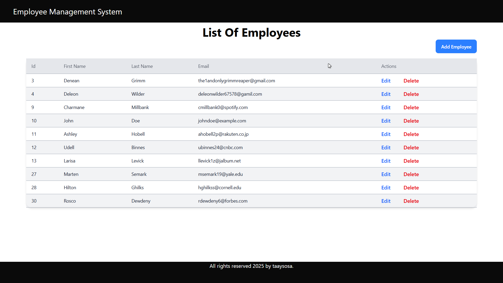
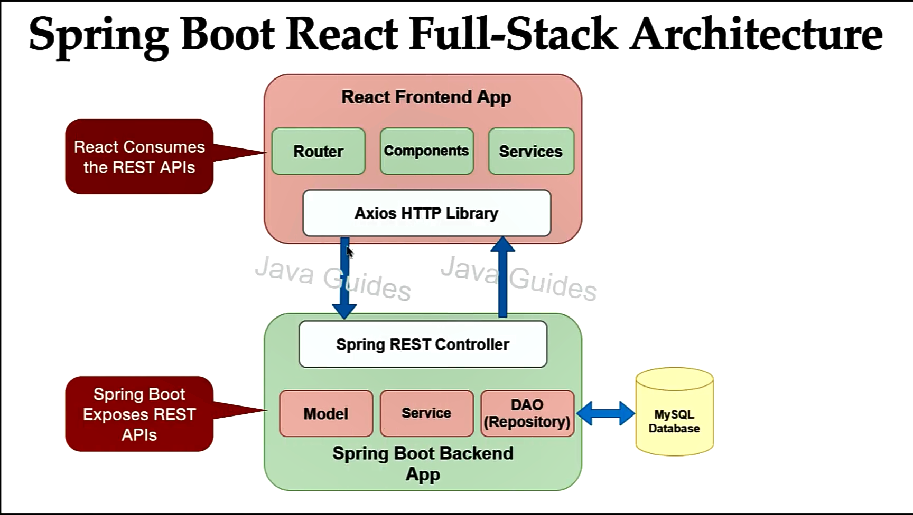

<div align="center">

# Employee Management System.

[](https://github.com/)
[]()
[](https://start.spring.io/)
[](https://www.oracle.com/africa/java/technologies/downloads/)
[](http://maven.apache.org/)
[]()
[]()
[]()
[](https://www.npmjs.com/)
[](https://tailwindcss.com/)
[](https://www.mysql.com/)
[](https://www.postman.com/)

<!--  https://github.com/user-attachments/assets/871d5a10-f09b-4e2a-8e80-c23087c65216 
  -->


</div>

## 📝Summary.
The Employee Management System is a comprehensive web application designed to streamline and enhance the 
management of employee-related tasks within an organization. This system utilizes a modern and efficient 
technology stack, including Spring Boot for the backend, React for the frontend, and MySQL for the database.

## 🏛️Architecture.
The architecture diagram for the system is shown below:
<p align="center">

</p>

## 🌳️Repository overview.
```
ems/
├── ems-backend/                            # Spring Boot API (Authentication, Business Logic).
│   ├── .mvn/wrapper/
│   └── src/
│       ├── main/
│       │   ├── java/com/example/ems/
│       │   │   ├── controller/
│       │   │   ├── dto/
│       │   │   ├── entity/
│       │   │   ├── exception/
│       │   │   ├── mapper/
│       │   │   ├── repository/
│       │   │   └── service/
│       │   │       └── impl/
│       │   └── resources/
│       └── test/java/com/example/ems/
├── ems-frontend/                           # React Web App (UI & Client Interaction).
│   ├── public/
│   └── src/
│       ├── component/
│       ├── constant/
│       └── service/     
├── database/                               # Database assets (images, icons, etc.)
├── docs/                                   # Documentation, ADRs, Security Reports (private for now)
├── assets/                                 # Visually demonstrations and assets (images, icons, etc.)
├── README.md/                              # Provides an overview of the project, instructions, and other relevant information.
├── .gitignore/                             # Documentation, ADRs, Security Reports (private for now)
└── LICENSE/                                # Specifies the licensing terms for the project.

```

## 🤖Technology Stack.
**Backend**

The backend, powered by Spring Boot, handles data processing, business logic, and database interactions. It exposes 
RESTful APIs that the frontend consumes for seamless communication. Spring Boot's modular and organized structure 
simplifies code maintenance and promotes scalability.

- Spring-boot.
- Spring Data .
- Java.
- Maven.
- MySQL.

**Frontend**

React for the frontend, which provides a dynamic and responsive user interface. It facilitates the creation of modular 
components and services, enhancing code maintainability and reusability.

- React.
- JavaScript.
- Axios.
- React-Router-Dom.
- NPM.

## ✨Key Features.

## 📊Database Design.

## 📜Documentation & References.

## 🚀Getting started.
Follow these instructions to setup a copy of the project and run it on your local machine for development and testing purposes.

## 👨‍💻Authors.
#### Taay Sosa
[](https://github.com/Taay21Sosa)

If you liked this repo then kindly support it by giving it a star ⭐ and share it with your friends so that more people can benefit from the effort.

## ⚠️Issues.
The project may contain code and comments that are not fully optimized. The code may include redundant sections, unoptimized logic, and inefficient algorithms. The comments are also inconsistent, with some sections having no comments, others containing poorly written explanations, and some comments not accurately reflecting the code's function.
> [!NOTE]
> Despite these issues, the program is designed to be functional, and it's expected to run without critical errors. This is a temporary state, and future updates will include a thorough code cleanup and optimization process. 🧹

## ⚖️License.
[](../master/LICENSE)

Copyright (c) 2025-present, Taay21Sosa, T.Monaheng.
